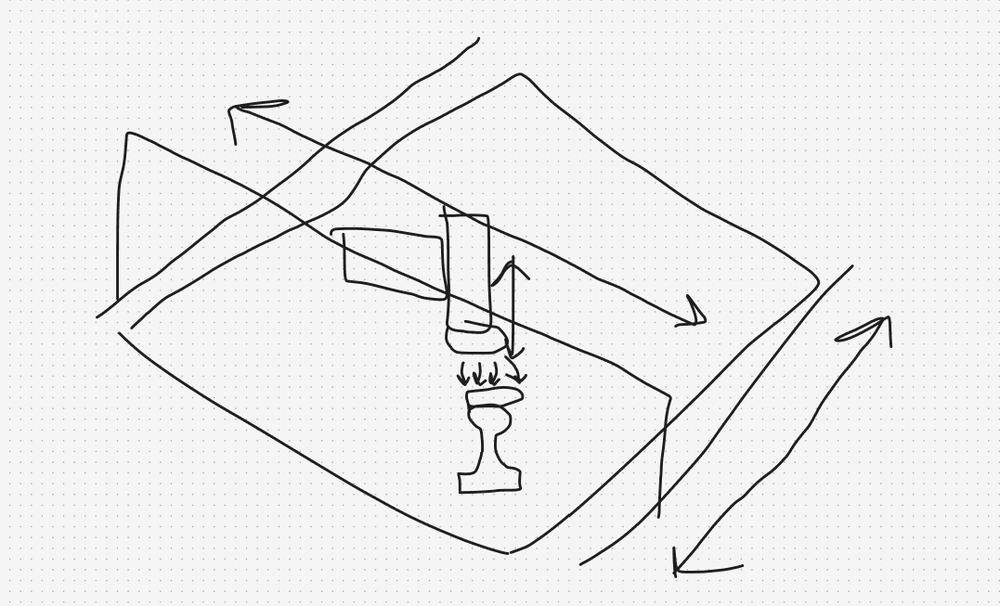

# chessler Journal

## June 13th, 2026
New project time!

I've been thinking about this one for a couple days. It's a chess playing robot. My original idea was to have a gantry, but after deliberation I realized that an under the board design would be more compact, cleaner, and cheaper.

I would use a camera to detect the pieces. Object detection can be quite hard, but I realized that I can just attach pieces of coloured paper to the tops of the pieces, and then just use colour detection to find the pieces.

I started sourcing parts from aliexpress.

I'm using MGN12 rails, which use M3 hardware which I already have.

I also found a nice tiny electromagnet:

It's 20mm wide and 15mm thick with 30N of holding force.

About the magnet, I needed to make sure that it would be strong enough to drag pieces, but not so strong that it would pick up pieces unintendedly. (Picking up *A* piece is way easier than picking up *ONE* piece). I did some back of the napkin calculations and found that magnetic force generally dissipiates by 1/r^4. Meaning that the force of the electromagnet on side pieces is <1% of the force of a centered piece. (Assuming 6mm thick MDF and 45mm center to center piece distance).

I picked up some other things, like a bigger Nema 17 motor, M3 t-nuts, M5 brackets, extrusion, and optical endstops.

I then hopped into fusion and started designing this.

Funny thing, I actually have quite a lot of experience designing with Aluminum extrusion. I did it all the time for FRC, and man I hated it. I really thought I escaped it!

However, when you can actually source proper components for it, it's pretty nice!

I made the X axis belt run over the side extrusion, and started designing the gantry to hold the motor and clamp onto the belt. Lowkey, I don't really anticipate this taking too much time—most of it was spent sourcing parts. Tomorrow I'll have a lot of time to cad out the rest of the project, and then refine the tiny details and total the parts. After that, I'll start making the PCB for it.

Time today: 4.0 hours  
**Time total: 4.0 hours**  

## June 14th, 2026

Locked in so hard today. I went to the library and spent around a half hour looking at components on aliexpress. I realized that I didn't need optical endstops because I already had leftovers. I then hopped into fusion and continued designing.

I designed the actually chessboard, and then refined some of the parts.

I added the pulleys:

and the bolt counterbores:

I also designed the pulley holder for the gantry.

Funny story on this one, I actually originally designed it to bolt directly to the extrusion. So... it wouldn't be able to slide with the rest of the gantry. I had to redesign it to mount directly to the plate, and then redesign it AGAIN so that it wouldn't interfere with the carriage.

I then fleshed out the belt clamp for the gantry:

and one for the carriage:

I then modelled the electromagnet and mounted it to the carriage:

I had a couple problems with the carriage. Namely, it interfered with the pulley holder (so I had to redesign it), and I had to shift the Nema motor back to allow for the carriage to get close to the edges.

I then added the texture to the chessboard:

I then joined it so that the electromagnet at it's bounds were under the center of each corner square, and created mounts to connect it to the extrusion

I still have work to do in fusion, namely filleting and legs for the extrusion frame.

I'm currently debating what to make the board out of. 1/4" MDF was my original plan, but acrylic would be pretty sick because you can look through it to see the electromagnet moving (also makes integration and debugging easier!).

After I got home from the library, I sat down and worked on the kicad schematic.

This is my first time putting actual chips on the pcb, instead of using sockets, so I had to do a lot of research on that.

I picked up an esp32 wroom chip with flash (to run a shitty stockfish later), a usb-uart bridge, a usb c port, and a buck converter.

I then started learning how to wire it up.

First I did the usb c port with its 5.1kΩ resistors, and then hooked it up the CH340C usb-uart bridge.

I then connected the bridge like it said to in the datasheet, and then set up the RTS and DTR pins to be able to reset the esp32 while programming.

I had a hiccup here, the only datasheet I could find (the one on JLC) was in chinese, so I had to translate the entire document and use the scuffed misaligned translation to figure out pin purposes.

I then set up the electromagnet. It's not a super beefy one, 12V @ 0.13A, so I don't need to worry too much about heat dissipation. I set up the mosfet to be controlled by the esp32, and then added a flyback diode to protect from the electromagnet dumping voltage back into the circuit.

I hooked up the tmc2209s. Last time I used pure UART control, which was pretty neat, but kinda hard to find a library. It also doesn't allow for more complex motion profiles (which this project would benefit from). So I decided to use UART for configuration, and then the usual step/dir for motion control via bit banging.

I then set up the power supply and buck converter. This was honestly the hardest part because I've never done anything like this before (I usually just used a buck breakout board).

I followed the datasheet and set correct values and routing. So, decoupling capacitors, the voltage divider (with their chosen resistors), the inductor (which I have never used before), and the switching pins. There's a lot of weird component values here like a 10pF capacitor on feedback and a 7nF capacitor on SS, but I matched the datasheet so I hope it works!

Here's the finished schematic! Honestly the most complex electrical thing I've ever done, and I'm proud of it. I still have to pick the components from JLC, but I think I have a good idea of what I want (0603 passives & x(5/7)r ceramic capacitors). After that's done, I can start the PCB layout and routing!

Time today: 9.0 hours  
**Time total: 13.0 hours**  

## June 15th, 2026

Today I wrapped up the schematic and part sourcing for the PCB.

The first thing I did was add the endstops to the schematic.

I sourced all the parts for my inductor, resistors, capacitors, transistors, and my mosfet. I made sure to use basic or promotional extended for all of my parts, and then tried to use 0603 whereever I could.

I then went through and swapped up the schematic symbols with JLC symbols from easyeda2kicad. This was pretty shitty because literally all of the symbols were rotated 90deg from the standard kicad symbols, AND were 1 unit longer.

I then assigned all of my footprints and loaded everything into PCBNEW.

(it's looking to be a pretty complex board!)

I exported my bom and loaded it into JLC.

It took a bit of finagling (I didn't check basic/extended status for some parts), but I got it down to $50usd for pcba and shipping!

I have some passives left over from previous projects, so I can avoid extended parts and just hand solder them in.

There were also a couple issues. I.e. the transistors, mosfet, and the usb-uart bridge were all rotated wrong in translation. I'll need to go through the kicad jlc plugin docs to figure out how to rectify that.

Other than that, it's going pretty great!

Time today: 3.5 hours  
**Time total: 16.5 hours**  